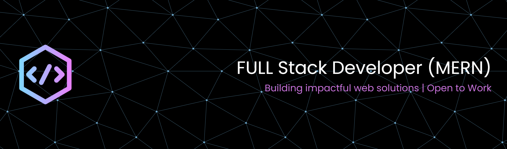

<h1>Hi 👋, I'm Atul Rao</h1>

 

💼 BCA @ University of Rajasthan  •  🚀 Full Stack Developer  •  📍 Jaipur, India

 

---

### 🛠️ Tech Stack & Tools

---

### 📊 GitHub Metrics

  

  

  

---

### 🐍 Contribution Graph

---

### 🌐 Connect

 

  

